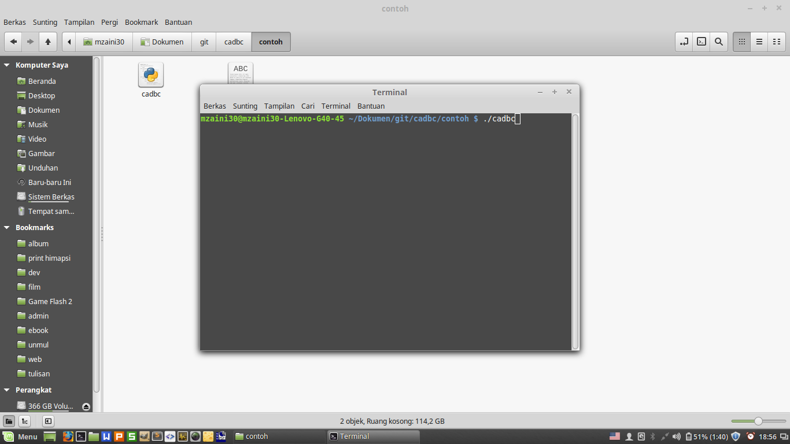
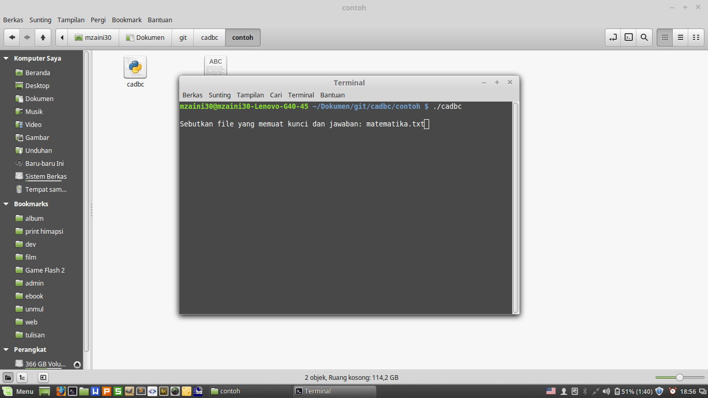
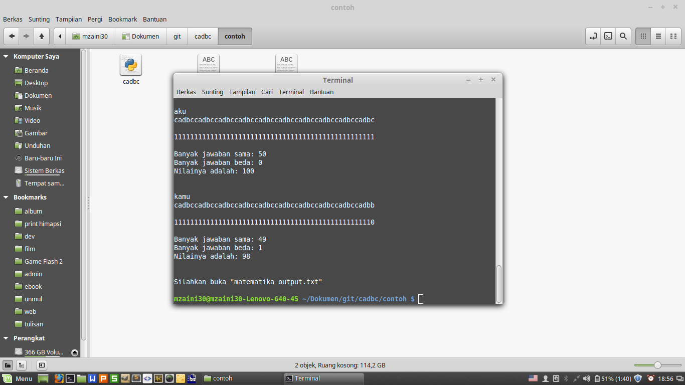
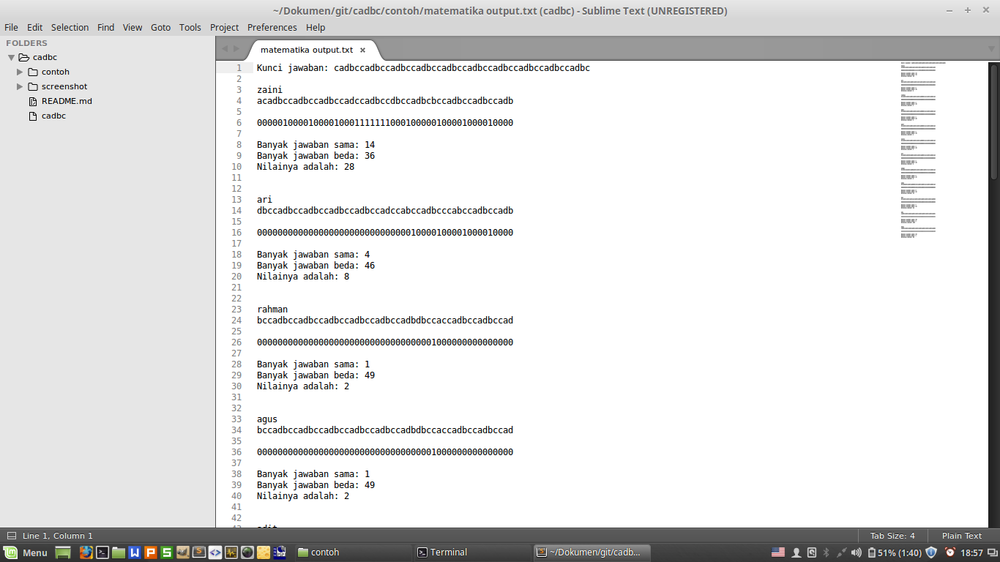

# cadbc

Aplikasi untuk mengecek jawaban pilihan ganda, dibuat dengan Python

## Penggunaan

1. Letakkan file _cadbc_ bersama file yang berisi kunci jawaban dan jawaban-jawaban siswa (lihat file _matematika.txt_ di folder _contoh_)
2. Buka terminal lalu ketikkan _./cadbc_

## Format Penulisan File Kunci Jawaban Beserta Jawaban

lihat file _matematika.txt_ di folder _contoh_


```
cadbccadbccadbccadbc (kunci jawaban)

zaini: cadbccadbccadbccadbccadbccadbc (nama siswa, titik dua, spasi, jawabannya)
zaini: cadbccadbccadbccadbccadbccadbc (nama siswa, titik dua, spasi, jawabannya)
zaini: cadbccadbccadbccadbccadbccadbc (nama siswa, titik dua, spasi, jawabannya)
zaini: cadbccadbccadbccadbccadbccadbc (nama siswa, titik dua, spasi, jawabannya)
```

Jangan lupa untuk mengkosongkan baris kedua

## Screenshot







